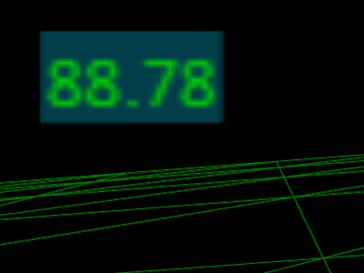
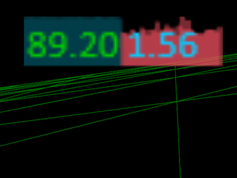
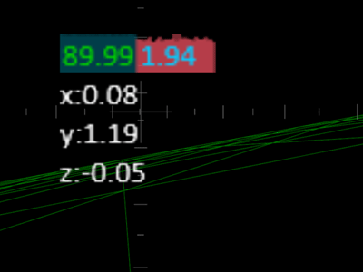
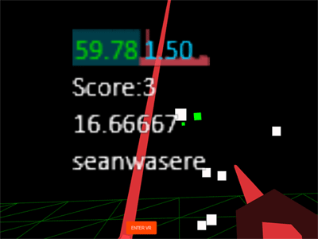

# StatsVR

Performance statistics HUD specifically for WebVR &amp; THREE.js Projects that use a HMD, such as Oculus Rift

The purpose of StatsVR is to monitor your computers performance while developing and running your application so that you don't need to remove your headset to check.

The StatsVR HUD displays the

- frames per second (FPS),
- millisecond duration (MS) of a section of code,
- Up to 3 custom variables in the HMD view, always facing the camera, and always on top of other meshes in the scene,
- Custom Object3Ds that you can also attach to the StatsVR Object3D. See Example 3.

You can download the project and view the examples.

```bash
git clone https://github.com/Sean-Bradley/StatsVR.git
cd StatsVR
npm install
npm run dev
```

Visit http://127.0.0.1:3000/

This is a typescript project consisting of two sub projects with there own _tsconfigs_.

To edit this example, then modify the files in ./src/client/ or ./src/server/.

The projects will auto recompile if you started it by using _npm run dev_

```javascript
import StatsVR from "statsvr";
```

## Simplest Example

- Import StatsVR
  ```javascript
  import StatsVR from "statsvr";
  ```
- Instantiate and position StatsVR
  ```javascript
  //pass in an existing scene and camera
  const statsVR = new StatsVR(scene, camera);
  //change default statsvr position
  statsVR.setX(0);
  statsVR.setY(0);
  statsVR.setZ(-2);
  ```
- Update StatsVR in the render loop
  ```javascript
  statsVR.update();
  ```

See the source code of the working examples.

## Example 1

Basic StatsVR setup for WebVR and Threejs projects.

[StatsVR Example 1](https://sbcode.net/threejs/statsvr-1/)

[](https://sbcode.net/threejs/statsvr-1/)

## Example 2

Advanced StatsVR for WebVR and Threejs projects. Change position and show Millisecond Graph.

[StatsVR Example 2](https://sbcode.net/threejs/statsvr-2/)

[](https://sbcode.net/threejs/statsvr-2/)

## Example 3

Advanced StatsVR for WebVR and Threejs projects. Custom Variables and custom 3d objects.

[StatsVR Example 3](https://sbcode.net/threejs/statsvr-3/)

[](https://sbcode.net/threejs/statsvr-3/)

## Example 4

StatsVR in a minigame using WebVR, Threejs, Haptic Feedback and Collision Detection.

[StatsVR Example 4](https://sbcode.net/threejs/statsvr-4/)

[](https://sbcode.net/threejs/statsvr-4/)

<!-- ## Video Tutorial of using StatsVR
[](https://www.youtube.com/watch?v=TZNZoaiTUwg) -->

<!-- ## StatsVR GitHub Repository
https://github.com/Sean-Bradley/StatsVR -->

<!-- ## StatsVR Examples,
https://sean-bradley.github.io/StatsVR/  -->
<!--
## Initial Setup
Download statsvr.js, save it, and include reference to script in your html head. eg

``<script type="text/javascript" src="statsvr.min.js"></script>`` -->

<!-- Create global variables
```javascript
var camera, scene, renderer;  // these are commonly used THREE.js variables and may already exist in your project
var statsVR; // create your global statsvr variable. I named mine statsVR

function init(){
	// existing THREE.js and webvr setup goes here
	// then after you've instantiated the THREE.js renderer, scene and camera objects,
	statsVR = new StatsVR(scene, camera);  // pass your scene and camera objects to the StatsVR constructor
}
init();
```

## Showing the Default FPS Counter and Graph


To show the default StatsVR FPS counter and graph, add the line
``statsVR.update();``
anywhere inside your THREE.js render or animation loop.

eg,
```javascript
function render() {
	// your existing animation magic

	statsVR.update();  // required anywhere within the loop

	renderer.render(scene, camera)
}
renderer.animate(render);
```

## Showing the FPS and also the optional MS Counters and Graphs


To show the StatsVR FPS along with the optional MS counter and graph, also add the lines

```javascript
statsVR.msStart();
//code you want to monitor the MS duration of goes here
statsVR.msEnd();
```

anywhere inside your THREE.js render or animation loop.

eg,
```javascript
function render() {
	// your existing animation magic
	statsVR.msStart(); // starts the MS monitor timespan
	// specific code you want to monitor the MS duration of goes here
	statsVR.msEnd(); // ends the MS monitor timespan

	statsVR.update(); //required anywhere within the loop

	renderer.render(scene, camera)
}
renderer.animate(render);
```
or, if you want to check the MS duration of your entire render or animation loop, put the ``msStart()`` and ``msEnd()`` procedure calls at the beginning and end of your entire render loop.
eg,
```javascript
function render() {
	statsVR.msStart(); // starts the MS monitor timespan

	// your existing animation magic

	statsVR.update();  // required anywhere within the loop

	renderer.render(scene, camera)

	statsVR.msEnd(); // end the MS monitor timespan
}
renderer.animate(render);
```


### Also Show the optional custom fields along with the usual FPS and optional MS Counters and Graphs.


You can also show up to 3 extra custom values in the display, such as values you may want to track during execution of your program.
eg, anywhere witihn your render loop,
```javascript
statsVR.setCustom1(myVar);
statsVR.setCustom2(anotherVar);
statsVR.setCustom3(optionalyAnyOtherVarYouWantToMonitor);
```


### Customising the StatsVR position inside the HMD view
The default panel is shown at offset
```javascript
X = 0,
Y = 1.5,
Z = -5
```
from the camera position and rotation in the THREE.js worldspace.
You can modify those defaults if you want, eg, after you initialise the StatsVR object, you can change it's display coordinates.
```
statsVR.setX(1);
statsVR.setY(0);
statsVR.setZ(-10);
```


The benefit of using StatsVR is that you don't need to remove the HMD to view the FPS or any other custom variable you want to monitor.


### Set Visibility
```javascript
statsVR.setEnabled(true);  //visible, default
statsVR.setEnabled(false); //hidden
```
Note that the StatsVR is still in memory and may still be updated by your code.
StatsVR was originally written as as a debug tool, so you will get slightly better performance by removing StatsVR once you are satisified with your performance of your code or when compiling your production build.


 -->
